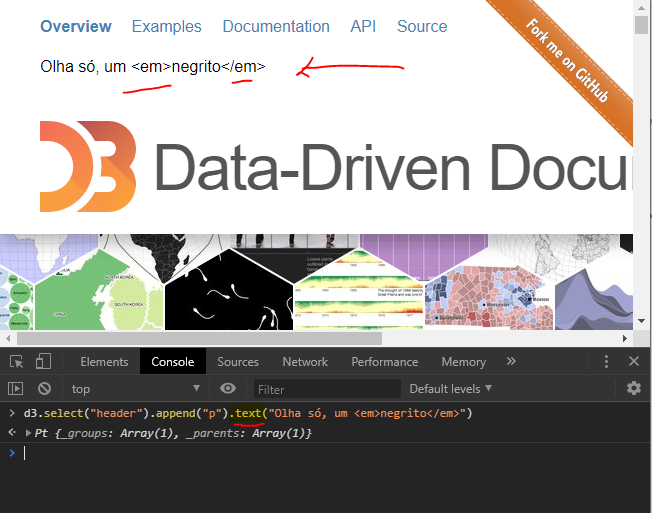
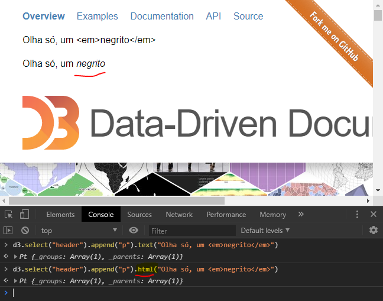

# Javascript

### Functions

Arrow functions:

Caso se use `{` e `}`, tem que usar `return`:

```js
(a, b) => {
    return ...
}
```

### Control Structures

```javascript
let color;
if (v1 === 10) {
    color = "blue"
} else {
    color = "red"
}

// ternary operator
let color = v1 === 10 ? "blue" : "red;
```

#### Loops

```javascript

for (let i = 1; i < 21; i+=1){
    console.log(i);
}

let j = 1;
while (j < 21){
    console.log(j);
    j+=1;
}

let k = 1;
while (true) {
    console.log(k);
    k += 1;
    if (k > 21) break;
}
```

Essa construção não conhecia, para iterar com `for` sobre os elementos de um array:

```js
let a = [1,2,3,4];

for (let elemento of a) {
    console.log(elemento)
}

```

### Manipulating Arrays

#### Slice

```js
arr.slice([begin[, end]])
```

#### Including and removing elements

A negative index can be used, indicating an offset from the end of the sequence. `slice(-2)` extracts the last two elements in the sequence.

`arr.push()` acrescenta ao final, 
`arr.pop()` remove o último elemento,
`arr.slice(0, -1)` faz uma cópia da array, removendo o último elemento (mas não altera a array original).

#### Map, Reduce, Filter, Sort

Reduce

```js
let employees = [ {name:"Ali", salary: 50000},
                  {name:"Zoe", salary:75000},
                  {name:"Jack", salary: 60000},
                  {name:"Felix", salary: 35000}];

d3.sum(employees, d => d.salary) // 220000
employees.reduce( (acumulado, valor_da_vez) => acumulado + valor_da_vez.salary, 0)

```

#### Fazendo um gather

```js
data.map(d => {
    // vai pegar as colunas cujos títulos são números, ou seja, para elas, +nome_coluna vai dar NaN.
    let years = Object.keys(d).filter(k => !isNaN(+k))

    let history = years.map(y => ({
        year : y,
        value : +d[y]
    }))
    d.history = history;
}

)

```


### Manipulating the DOM

```javascript

document.write("tsa, não sabia dessa.");

```

Alterando o estilo de um elemento, JS x D3:

```js
document.querySelector("#AirlinesChart").style.border = "5px solid blue"
// comparar com
d3.select("#AirlinesChart").style("border", "3px dashed limegreen")
```


Talvez ressaltar as idiossincrasias: 

* separar propriedades por "," e não ";". Os valores de propriedades são declarados com ":", e não "=". Essas coisas acabam sendo boas, porque te remetem ao contexto em que aqueles dados estão sendo utilizados.

* contagem começa por "0" x length da array

* nome do parâmetro na declaração de uma função... não usar o mesmo nome da variável que vai ser passada como argumento, para evitar confusão.

Outras coisas:

mostrar como vc vai precisando de outras funções e métodos pra fazer coisas simples. tipo, detectar o nome de um arquivo antes da extensão, a partir do nome completo com extensão.

mostrar que esses `d` que usamos como argumentos, parâmetros, pode ter qualquer nome.

na verdade, tentar explicar de onde vêm esses argumentos "fantasma" que são usados nas funções anônimas dos métodos. tipo, dentro de um promise, lá no `.then(function(data){...})` quem danado é esse `data`? como eu sei quem são os argumentos que posso usar nessa função anônima?

quando você usa `this`, você esta usando o `node`, e aí você só pode usar as funções nativas do JS. se você encapsula o `this` numa **selection**, `d3.select(this)` aí você tem à disposição todos os métodos de D3.

# D3

## "glue"

Por exemplo,

```js
.attr("transform", d => 'translate((${d.x0}, ${d.y0}))')
```

## joins

quando você faz `.data(dados)`,  e depois usa um accessor com `d => ...`, vc basicamente está dizendo, pegue cada elemento de `dados` e faça uma determinada ação.

## Selections

Get the actual node from a selection:

```js
let $h1 = d3.select("h1");

console.log($h1);
// Pt {_groups: Array(1), _parents: Array(1)}

console.log($h1.node())
// <h1>...</h1>

let _h1 = document.querySelector("h1");

console.log(_h1);
// <h1>...</h1>

```

Então `d3.select(selector).node()` equivale a `document.querySelector(selector)`.

Outra coisa:

`d3.selectAll("p").node()` equivale a `d3.selectAll("p").nodes()[0]`, porque nesse caso existe uma array de nodes, e `.node()` retorna o primeiro elemento da array. `.nodes()` retorna a array inteira.

Um detalhe para a pequena e sutil diferença entre o que é apresentado no console para `d3.selectAll("p").nodes()` e `document.querySelectorAll("p")`:


### tamanho da seleção

`d3.selectAll("p").size()`,

que equivale a

`d3.selectAll("p").nodes().length`

ou ainda a 

`document.querySelectorAll("p").length`


### selection.text() vs.selection.html()






When using `selection.html()`, the content passed in as argument will actually be parsed as html.

## interaction

Events: `mouseover`, `mouseout`, `click`, `change`, `mouseenter`, `mouseleave`, `mousemove`

`d3.event.x`, `d3.event.y`
`d3.event.selection`, `d3.event.clientX`, `d3.event.clientY`

`d3.mouse(this)` -- array com x em `[0]` e y em `[1]`

`onclick` attribute (for buttons elements, e.g.)

When use it ("inline events"), instead of adding an event listener?

## outros

### obtendo vs definindo valores


## scales

### quick color scales

Se faço

```js
let cScale = d3.scaleOrdinal(d3.schemeCategory10)
```

tenho uma escala rápida sem me preocupar com range ou domain.

### scaleBand

`d3.scaleBand().padding(value)`

### scaleTime

## line generator

`.defined(d => !!d.price)`

## Layouts

### treemap
 
```js
d3.treemap()
  .size()
  .paddingInner()
```

# dúvidas

como funciona direito d3.csv
promises, Promisse All
New Date(d.date)
como d3.hierarchy espera o dado?
mouseover x mouseenter?